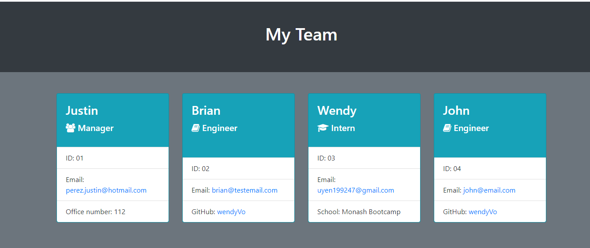

# Team Profile Generator
    
  

## Table of Contents
- [Description](#description)
- [Installation](#installation)
- [Usage](#usage)
- [License](#license)
- [Contributing](#contributing)
- [Tests](#tests)
- [Questions](#questions)

## Description
A Node.js CLI application  that takes in information about employees on a software engineering team, then generates an HTML webpage that displays summaries for each person.Testing is key to making code maintainable, so you’ll also write a unit test for every part of your code and ensure that it passes each test.

## Installation
Run npm install to get all the nescessary files in nodes module. The program is run with the command "node index.js".

## Usage
Use "node index.js" to run the application.
 

 
[Video Link](https://drive.google.com/file/d/1YFB2yDjN2NszO16DKSOnmnzpCuSr8yhN/view)

## License

 
This application is covered under  license. 

## Contributing
Contributors: Wendy Uyen Vo.  
Please read this [Setting guidelines for repository contributors](https://docs.github.com/en/github/building-a-strong-community/setting-guidelines-for-repository-contributors) for more informations.

## Tests
jest Test

## Links to the GitHub Repositories:

The URL of the GitHub repository: https://github.com/wendyVo/teamProfile-generator.git

## Questions

Please contact me should you have any questions:  
:email:   Email: uyen199247@gmail.com  
:octocat: GitHub:  [wendyVo](https://github.com/wendyVo)

